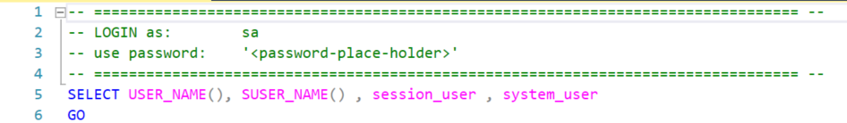

# SQL-Security

This is a solution to implement SQL Server security mechanisms to protect data

The implementation is structured using the following features:

## Dynamic Data Masking

## Row Level Security

## Auditing

## Server Roles, Database Roles, and Custom Roles

This solution **prioritized** finding options using **built-in permissions**, as these are easy to implement and backward compatible with future SQL Server versions

## Ledger

  It is recommended to work first with the contents on the AUDITING folder, and then use the contents on the other folders as needed

  **NOTE**: the database used is a copy of the AdventureWorks sample database 
  You can download a copy of the AdventureWorks database from [here](https://github.com/Microsoft/sql-server-samples/releases/download/adventureworks/AdventureWorks2019.bak) 
  The examples are based on the [AdventureWorks2019](https://github.com/Microsoft/sql-server-samples/releases/download/adventureworks/AdventureWorks2019.bak) version - but any version should work with minimal adjustments 

## NOTES: 

### 1-  All scripts display the **login name** to be used for that script at the very top. 
#### line 2 on the image below shows to use **sa**.

 
<ul>
<li>Execute the Query to display the username to make sure you are using the correct persona</li>
<li>For scripts that switch between MASTER and the SQLSecurityDemoDB databases:<ul>
  <li>After Switching the database, execute the query to display the username again, so you can see how that user is mapped</li>
  <li>When testing these scripts on Azure SQL Database the **USE** command will fail, you need to switch the database manually via SSMS toolbar</li>
  </ul>
</ul>
 

## disclaimer

  This Sample Code is provided for illustration only and is not intended to be used in a production environment. 
  THIS SAMPLE CODE AND ANY RELATED INFORMATION ARE PROVIDED "AS IS" WITHOUT WARRANTY OF ANY KIND, EITHER EXPRESSED OR IMPLIED, INCLUDING BUT
  NOT LIMITED TO THE IMPLIED WARRANTIES OF MERCHANTABILITY AND/OR FITNESS FOR A PARTICULAR 
  PURPOSE.  We grant You a nonexclusive, royalty-free right to use and modify the Sample Code
  and to reproduce and distribute the object code form of the Sample Code, provided that You
  agree:  
    (i) to not use Our name, logo, or trademarks to market Your software product in which the Sample Code is embedded; 
    (ii) to include a valid copyright notice on Your software product in which the Sample is embedded; 
    and (iii) to indemnify, hold harmless, and defend Us and Our suppliers from and against any claims or lawsuits, including attorneys fees, that arise or result from the use or distribution of the Sample Code.  

## References

The following links are useful resources for your study / SQL security review.
- [Workpshop: SQL Security Ground to Cloud](https://github.com/David-Seis/SecureYourAzureData) by Buck Woody and David Seis 
- [Packaging Permissions in Stored Procedures](https://www.sommarskog.se/grantperm.html) by Erland Sommarskog, SQL Server MVP - updated on 2023-06-13. 
- [New granular permissions for SQL Server 2022 and Azure SQL to improve adherence with PoLP](https://techcommunity.microsoft.com/t5/sql-server-blog/new-granular-permissions-for-sql-server-2022-and-azure-sql-to/ba-p/3607507) by Andreas Wolter 
  
  
